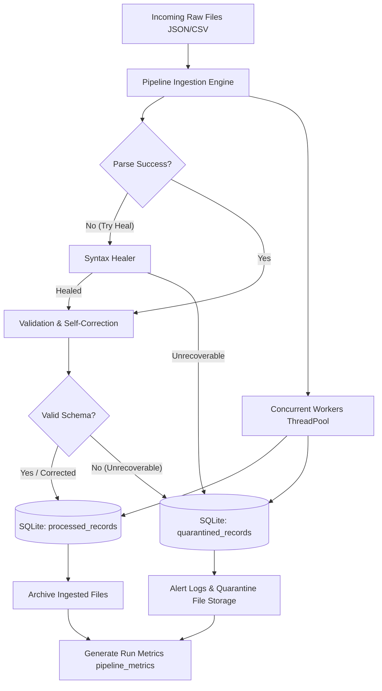

# 🤖 Day 14: Week 2 Capstone — Self-Correcting Agentic Data Pipeline

An end-to-end production-grade Python ETL pipeline integrating error handling, logging, testing, databases, config management, parallelism, and CLIs. This project demonstrates how an agentic pipeline can ingest raw JSON/CSV inputs, enforce a validation schema, heal corrupt or format-driffed values automatically (Self-Correction), and load cleaned records in parallel into a SQLite database.

---

## 🗺️ Project Architecture & Pipeline Flow

The pipeline executes through a series of robust modules:



---

## 🛠️ Key Features

1. **Config Management Hierarchy (`config.yaml` + Environment Variables + CLI)**
   - Custom YAML parser written from scratch with zero third-party dependencies.
   - Values from `config.yaml` can be overrode using environmental variables (e.g. `PIPELINE_DB_PATH`) and runtime parameters.
2. **Robust Self-Correction Engine**
   - **Timestamps:** Standardizes string timestamps (`YYYY-MM-DD HH:MM:SS`, `DD/MM/YYYY`, Unix floats) to timezone-aware ISO 8601 UTC.
   - **Integers/Floats:** Cleans messy numeric strings (e.g. currency signs `$`, commas, white spaces) and handles floating integers safely.
   - **Missing Data:** Fallback default injection for fields like `agent_id`, `status`, `cost`, and `tokens_used`.
   - **Structured IDs:** Auto-assigns UUIDs to records missing identifiers while preserving correction traces.
3. **Thread-Safe Concurrent Execution**
   - Orchestrates multi-file parsing, validation, and serialization via `ThreadPoolExecutor`.
   - SQLite transactions are protected using a centralized threading mutex (`threading.Lock`) combined with exponential backoff on database locks.
4. **Structured SQLite DB Schema**
   - `processed_records`: Clean/corrected records with a JSON history log of the applied changes.
   - `quarantined_records`: Payload trace and reason description for failed items.
   - `pipeline_metrics`: Performance audit logging of every run duration, row counts, and status indicators.
5. **Polished Argparse CLI**
   - Subcommands: `run`, `generate-data`, `inspect`, and `test`.

---

## 🚀 How to Run the Pipeline

### 1. Generate Mock Test Data
Creates files inside `data/input` representing clean data, repairable data, syntactically malformed JSON, and fully invalid records:
```bash
python day14_capstone_pipeline.py generate-data
```

### 2. Execute Ingestion Run
Starts the parallel ingestion pipeline:
```bash
python day14_capstone_pipeline.py run
```

### 3. Inspect Database Tables
Check execution history and records loaded in SQLite:
```bash
# Check run metrics
python day14_capstone_pipeline.py inspect --table metrics

# Check processed records
python day14_capstone_pipeline.py inspect --table processed

# Check quarantined items
python day14_capstone_pipeline.py inspect --table quarantine
```

### 4. Execute the Built-in Test Suite
Run the fully automated end-to-end integration test runner:
```bash
python day14_capstone_pipeline.py test
```

---

## 📂 Project Structure

```
day-14/
├── config.yaml                    # Global pipeline configuration
├── day14_capstone_pipeline.py     # Self-Correcting Data Pipeline
└── README.md                      # Documentation & architecture notes
```
